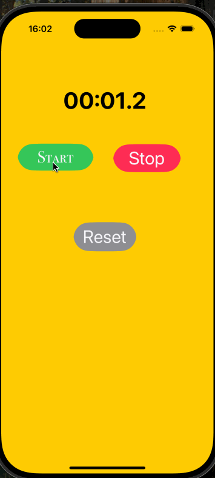

# Stopwatch App

---

## Introduction

The Stopwatch App is a beginner-friendly project designed to enhance iOS development skills using Swift and UIKit. It features basic stopwatch functionality with options to start, stop, and reset the timer, along with a dynamic display of hours, minutes, seconds, and milliseconds.

---

## Features

- **Start, Stop, Reset**: Control the stopwatch functionality with user-friendly buttons.
- **Elapsed Time Display**: The label updates dynamically, showing the time in `00:00:00.0` format.
- **Rounded Buttons**: Enhanced UI design with rounded corners for buttons.
- **Sound Effects**: Default sound effects play when interacting with the buttons.
- **Saved Lap Times**: (Optional) Store and view recorded lap times in a table view.

---

## Technologies Used

- **Language**: Swift
- **Framework**: UIKit
- **Development Tool**: Xcode

---

## How It Works

1. **Start Button**:
   - Starts the timer.
   - Updates the label every 0.1 seconds to reflect elapsed time.
   - Plays a default start sound when tapped.

2. **Stop Button**:
   - Pauses the timer without resetting elapsed time.
   - Plays a default stop sound when tapped.

3. **Reset Button**:
   - Stops the timer and resets elapsed time to `00:00:00.0`.
   - Updates the label and plays a reset sound.

4. **Lap Times (Optional)**:
   - (If enabled) Displays recorded times in a table view.

---

## Project Structure

- **UI Elements**:
  - `UILabel`: Displays the elapsed time.
  - `UIButton`: Controls the stopwatch functionality (Start, Stop, Reset).
  - `UITableView` (Optional): Shows recorded lap times.

- **Key Variables**:
  - `timer`: The `Timer` object managing time updates.
  - `elapsedTime`: Tracks the total time elapsed.

- **Core Functions**:
  - `startButton`: Initiates the timer and updates time regularly.
  - `stopButton`: Pauses the timer while keeping elapsed time intact.
  - `resetButton`: Resets elapsed time and updates the label to its default value.

---

## Screenshots

_

---

## Future Enhancements

- Add a dark mode theme.
- Include a "lap time" feature for better time management.
- Improve button animations and sound effects.

---

Feel free to use, modify, and expand this project as you learn more about iOS development! 😊
